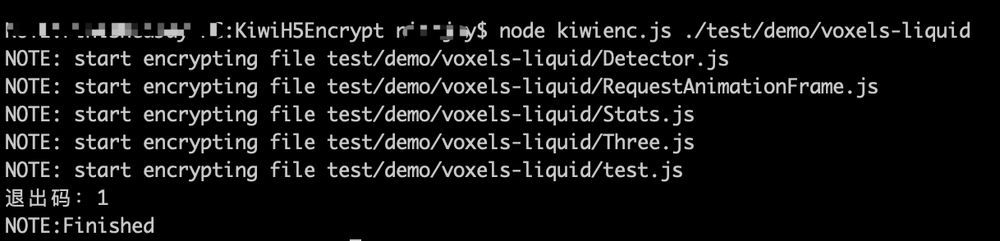
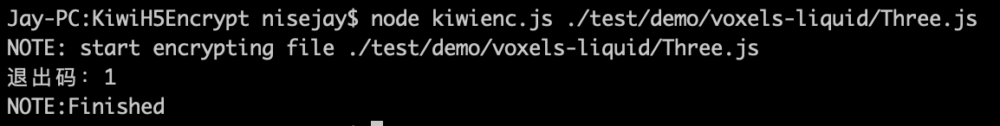

# KiwiJSProtect加密系统使用手册

## 1. 产品简述

几维安全 KiwiJSProtect（Kiwisec JavaScript Protect）利用私有算法，为JS代码提供诸如混淆变形、字符串加密、属性加密、调用转换等多项保护措施，提高攻击者分析JavaScript代码逻辑的难度，从而保护核心代码。

KiwiJSProtect是将JS代码通过私有算法等价转换成另一种复杂难懂的JS代码，在提供攻击者分析代码难度的同时可以兼容任意的JS运行环境，比如浏览器、微信小程序、自定义JS执行引擎等。


## 2. 功能概述

-  字符串加密

  对Javascript代码中的明文字符串加密或unicode转化，隐藏敏感信息，增加代码分析难度

- 属性加密
  
  针对Javascript对象的属性进行加密或unicode转化，隐藏代码之间的调用关系
  
- 代码混淆

  对Javascript代码的函数体进行逻辑混淆、变形等处理，增加代码分析难度

- 变量名混淆

  针对Javascript代码的全局变量名、局部变量名，采用无意义的符号进行混淆替换

- 反调试保护

  基于调试器特征，对当前运行环境进行检验，防止恶意调试代码
  
-  防日志泄漏

   禁用控制台console输出日志信息，防止敏感数据泄漏

## 3. 产品特点

- 上手简易

  提供在线和API接口方式，三步即可完成加密，针对大客户可定制离线命令行版本

- 兼容性良好

  Javascript代码加密后其兼容性和功能性测试通过率达到99%，不造成额外负担

- 体积增量小

  可调整加密参数强度，控制体积增量，适用Web端快速加载JS文件的场景

- 性能损失低

  可调节加密参数强度，控制代码性能损失，适用复杂算法加密的场景

## 4. 命令行使用方式

### 4.1 参数说明

| 参数名称                   | 描述                                                   |
| -------------------------- | ------------------------------------------------------ |
| `--anti-debug=1`           | 反调试保护开关，1开启，0关闭 【默认开启】              |
| `--string-encrypt-ratio=1` | 字符串加密比例，取值范围0～1【默认值为1】              |
| `--member-encrypt-type=0`  | 属性加密类型，0为函数转化，1为unicode转化【默认值为1】 |
| `--member-encrypt-ratio=1` | 属性加密比例，取值范围0～1【默认值为0.8】              |
| `--reserve-global-name=1`  | 是否保留全局变量，1保留，0关闭【默认值为1】            |
| `--code-obf=0`             | 代码混淆比例，取值范围0～1【默认值为0.3】              |
| `--anti-log=1`             | 防日志泄漏开关，1开启，0关闭【默认值为1】              |

针对性能要求高的加密需求，建议设置 `--member-encrypt-type=1`和`--code-obf=0`，例如：

```
//例如：
node kiwienc.js ./test/demo/voxels-liquid --member-encrypt-type=1 --code-obf=0
```

### 4.2 批量加密

可针对文件夹下的所有JS文件进行批量加密，参数指定文件夹路径即可，执行命令如下：

```
node kiwienc.js ./test/demo/voxels-liquid
```



###  4.3 单个加密

可针对单个JS文件进行加密，参数指定单个JS文件即可，执行命令如下：

```
node kiwienc.js ./test/demo/voxels-liquid/Three.js
```



## 5. 加密效果

- 对比静态JS文件，即可验证字符串加密、属性加密、代码混淆等效果

- 在浏览器中打开控制台，出现死循环卡死，即为反调试效果

  

## 6. 关于几维安全

几维安全(“成都盈海益讯科技有限公司”)，成立于2014年11月，是一家专注于移动安全的高新技术企业，总部位于成都。公司从移动开发底层技术路线出发，研发出代码指令混淆技术，全架构商用代码虚拟化技术、以此基础发展为多平台多架构产品体系和技术方案,致力于保护移动核心安全技术，助力对抗黑产，帮助客户业务能够安全有效的运行。

**成都研发总部**

公司电话：028-83177117

公司地址：成都市高新区萃华路89号节能大厦A座 4f-435 

**北京营销中心**

地址：北京市朝阳区望京SOHOT1-C座603

**杭州分公司**

地址：杭州市西湖区学院路58号华星创业大楼4楼401室 
